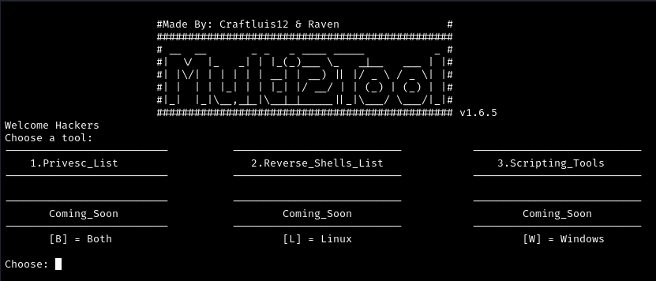

# Multi2Tool


## Description
Multi2Tool is a versatile program designed to enhance flexibility during penetration testing. It offers various functionalities including a hash identifier script (credit goes to Zion3R), an automated Nmap scanning script, a simplified ping tool (utilizing system ping), and a collection of scripts for privilege escalation and reverse shells. More tools and scripts are planned for future updates.

## How to Install
To install Multi2Tool, Copy and Paste the command:
```bash
curl -s -L -O https://raw.githubusercontent.com/craftluis12/Multi2Tool/main/Multi2Tool.cpp
g++ Multi2Tool.cpp -o Multi2Tool
```

## How to Use
Using Multi2Tool is straightforward:
Navigate through the program by typing the corresponding number of the tool/script you want to use or obtain.
To exit the program, simply press "Ctrl + C". To go back to the previous section, type "back". To go back to the menu type "menu". To update the program, type "update".

## Disclaimer
Multi2Tool is intended for educational and authorized testing purposes only. Misuse of this tool may violate applicable laws and regulations. The developers and contributors are not responsible for any illegal or unethical use of this software.

## Credits
The hash identifier script is credited to Zion3R.

## License
This project is licensed under the GNU General Public License v3.0 - see the LICENSE.txt ([LICENSE](https://github.com/craftluis12/Multi2Tool/blob/main/LICENSE))  file for details.

## Support
For questions, bug reports, or feature requests, please open an issue (https://github.com/craftluis12/Multi2Tool/issues) or contact craftluis12 or raven.
